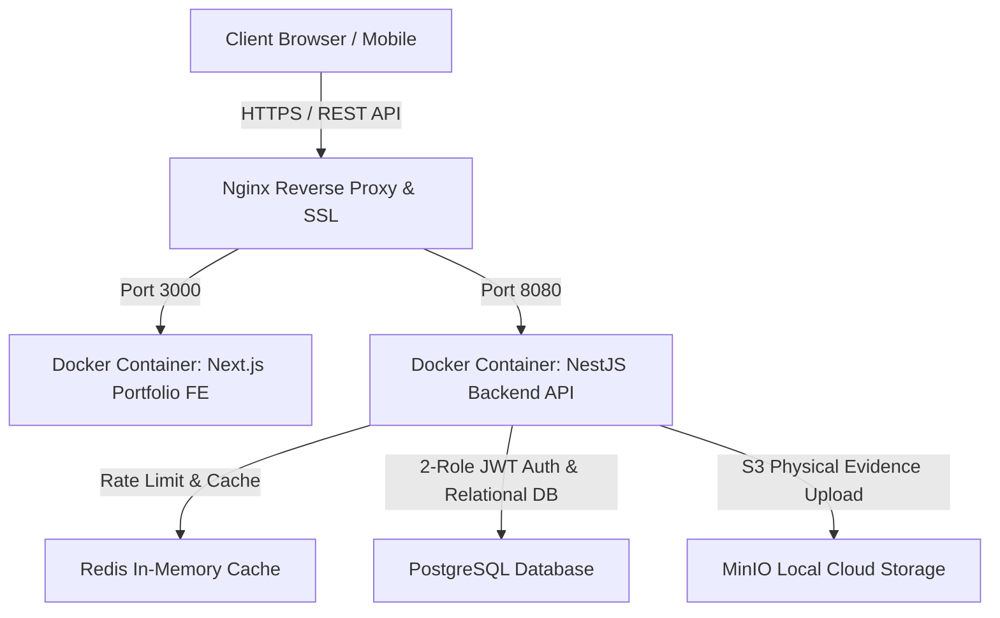

# Student Violation Recording System (APELSI) — Technical Portfolio Showcase

[](https://nextjs.org/)
[](https://react.dev/)
[](https://www.typescriptlang.org/)
[](https://tailwindcss.com/)
[](https://min.io/)
[](https://redis.io/)
[](https://www.docker.com/)

> **Role:** Full-Stack & DevOps Engineer  
> **Overview:** Standalone single-page technical portfolio platform yang menceritakan masalah, arsitektur, tantangan teknis, serta dilengkapi **2-Role Access Matrix (Admin & Guru)**, **Dark / Light Mode**, **Language Switcher (ID/EN)**, **MinIO S3 Storage**, **Redis Caching**, dan **Simulator Aplikasi Interaktif** untuk Sistem Pencatatan Pelanggaran Siswa (APELSI).

---

## 1. Judul & Ringkasan Eksekutif (*Elevator Pitch*)

### **Student Violation Recording System (APELSI)**

* **Role:** Full-Stack & DevOps Engineer
* **Overview:** Web platform terpusat yang dirancang untuk membantu guru mencatat, memantau, dan mengelola poin pelanggaran siswa secara *real-time* guna menggantikan sistem rekapitulasi manual berbasis kertas.

---

## 2. Masalah & Tantangan (*Problem Statement*)

Sebelum aplikasi ini dibangun, alur penanganan kedisiplinan dan pelanggaran siswa menghadapi kendala operasional utama:

* **Pencatatan Manual:** Guru bimbingan konseling (BK) dan tim kedisiplinan (Tatib) kesulitan mencatat serta melacak riwayat pelanggaran secara akurat di tengah tumpukan berkas fisik.
* **Risiko Kehilangan Data:** Rekapitulasi berbasis fisik rawan terselip, rusak, atau terbakar, sehingga menghilangkan histori poin kumulatif sanksi siswa.
* **Keterlambatan Informasi:** Sulit memberikan laporan pelanggaran yang transparan dan cepat kepada kepala sekolah maupun orang tua siswa secara berkala.

---

## 3. Solusi & Fitur Utama (*Solution & Key Features*)

Fokus pada fitur-fitur yang menyelesaikan masalah operasional sekolah dengan **2 Role Utama**:

* 🔐 **Otorisasi 2 Role (Admin & Guru / Tatib):**
  * **Admin Sekolah**: Bertugas memasukkan data master (Siswa, Kelas, Jenis Pelanggaran), melihat dashboard analytics, menginput pelanggaran, & mengontrol ekspor laporan/user.
  * **Guru (BK / Tatib)**: Bertugas melihat dashboard analytics & statistik, menginput data pelanggaran siswa, serta memantau akumulasi poin sanksi.
* ⚡ **Pencatatan Pelanggaran Cepat (*Quick Violation Entry*):** Form khusus guru & admin untuk menginput pelanggaran siswa lengkap dengan pembobotan poin otomatis dan foto bukti fisik di **MinIO Local Cloud Storage**.
* 📊 **Dashboard & Riwayat Siswa (*Student History Tracking*):** Akses cepat didukung **Redis In-Memory Caching** ke rekam jejak akumulasi poin pelanggaran siswa, grafik tren, dan tingkatan sanksi (SP1, SP2, SP3).
* 📑 **Laporan & Ekspor Data:** Fitur rekapitulasi otomatis dalam format PDF dan Excel (.xlsx) untuk keperluan rapat evaluasi.

---

## 4. Matriks Akses 2 Role (*Role-Based Access Control*)

| Fitur / Modul | Role Admin Sekolah | Role Guru (BK / Tatib) |
| --- | :---: | :---: |
| **Memasukkan Data Siswa & Kelas** | ✅ (Master Input) | ❌ Read Only |
| **Memasukkan Jenis Pelanggaran** | ✅ (Master Input) | ❌ Read Only |
| **Melihat Dashboard & Statistik** | ✅ Full View | ✅ Full View |
| **Input Data Pelanggaran Siswa** | ✅ Instant Entry | ✅ Instant Entry |
| **Upload Foto Bukti Physical (MinIO)** | ✅ Upload | ✅ Upload |
| **Ekspor Laporan PDF / Excel** | ✅ Export & Print | ✅ Export & Print |

---

## 5. Teknologi & Arsitektur (*Tech Stack*)

### Stack Teknologi

| Kategori | Teknologi | Deskripsi |
| --- | --- | --- |
| **Frontend** | React 19, Next.js 15, Tailwind CSS | Single-Page App, Dark/Light Mode, Language Switcher (ID/EN), Lucide Icons |
| **Backend** | NestJS / Express (REST API) | Modular Controllers, 2-Role JWT Authentication, Custom Guards |
| **Caching Layer** | Redis | In-Memory Point Query Cache & API Rate Limiter |
| **Database & Storage** | PostgreSQL, MinIO S3 | Relational DB & S3-Compatible Local Cloud Object Storage |
| **DevOps & Infra** | Docker, Nginx, CI/CD Pipeline | Multi-stage Docker build, Nginx Reverse Proxy, SSL |

### Flow Arsitektur Sistem



---

## 6. Dampak & Hasil (*Impact / Result*)

* ⏱️ **Efisiensi Waktu:** Memangkas waktu pencatatan dan rekapitulasi pelanggaran hingga **70%** dibanding cara manual berbasis kertas.
* 🎯 **Akurasi Data:** Meminimalisir kesalahan kalkulasi poin kumulatif dan memberikan kepastian status sanksi kedisiplinan siswa secara **100% akurat**.
* 💻 **Digitalisasi Workflow:** Berhasil mendigitalisasi total alur kerja penanganan disiplin siswa di lingkungan sekolah berbasis *paperless*.

---

## 7. Interactive Live Application Simulator

Proyek portofolio ini memiliki **Simulator Aplikasi Interaktif** bawaan (dapat diakses dengan mengklik tombol **"Coba Akun Demo"** di halaman beranda). Perekrut dan penguji dapat mensimulasikan pencatatan pelanggaran, penambahan master data siswa (Admin), penambahan poin real-time, monitoring data siswa, dan ekspor laporan langsung dari 1 halaman!

---

## 🚀 Panduan Instalasi Lokal (*Local Setup*)

```bash
# 1. Clone repository
git clone https://github.com/user/pelanggaran-fe.git
cd pelanggaran-fe

# 2. Install dependencies
npm install

# 3. Jalankan server portofolio
npm run dev
```

Buka [http://localhost:3000](http://localhost:3000) di browser Anda.